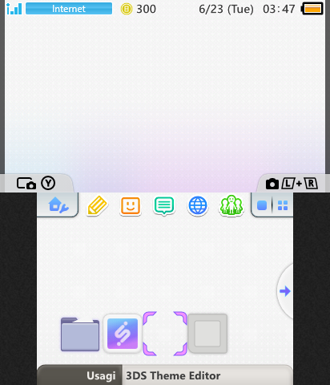
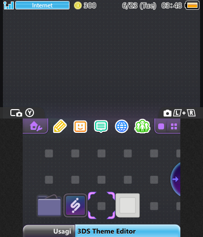
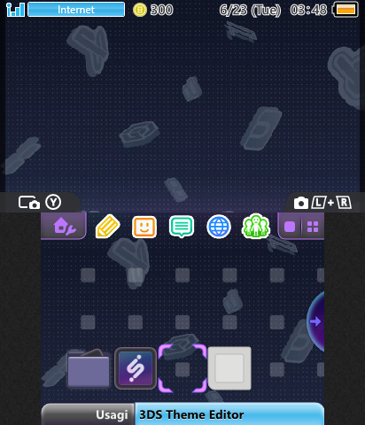

# iiSU 4 3DS

My first *true* theme for Nintendo 3DS, featuring custom colors, backgrounds, and background music! Made with Anemone3DS' theme format.

This was mostly completed within a day, though the sound part did baffle me a bit. Turns out the sound effects I was going to use didn't work sadly enough. Not sure why.

The "Website Dots" variants of the backgrounds were adjusted versions of the iiSU website's background to where it was isolated. Then the standard varaints were from more "traditional upload" of the iiSU wallpapers I found online. Then the "Decorated" variant was taken from iiSU's files itself and then adjusted a bit to make sense.

Colors look slightly better on console.

## NOTICE

***This theme is not made, affiliated, nor endorsed by iiSU nor Nintendo!***

iiSU, iiSU Network, and related terms are copyright belonging to ©iiSU.
Nintendo 3DS and related terms are trademarks belonging to Nintendo.

## Installation

Put any of the variations into your SD card's "themes" folder and then select within Anemone3DS and presto!
Press \[START] to then exit the app and then the theme should appear on your home menu!

### Incase of Crashes

Incase this somehow crashes (such as in the case of modifying or making your own theme), there's an easy remedy.
First, shut down your system and eject the SD Card. Then turn on your system and then reinsert the SD Card. It's recommended you change themes within Anemone or more preferably the system theme changer to ensure it gets changed, as it minimizes the chance of the theme being loaded and crashing.

Try other themes to see if they crash or not, if they do, then you have a problem!

## Previews:

|Default|Website Dots|
|-|-|
|||
||Dots from the iiSU website, isolated and put into background form.|

|Dark Mode|Web. Dark Dots|
|-|-|
|||
|A dark theme. Partially illuminated.|The original dark mode. A lot darker than the base version.|

|Decorated Theme|
|-|
||
|A decorated version of the Dark Mode. Doesn't animate.|

# Future Goals

- [x] Make basic 3DS Theme
- [ ] Add Sound Effects (Low Priority)
- [ ] Make in Advanced CIA Format :tada: (Format that shows up in the native theme switcher, Mid Priority)
- [ ] Vise Versa (3DS themes for iiSU Launcher, Low Priority)

These goals might not be fully realized soon, as my laptop is running out of space.
